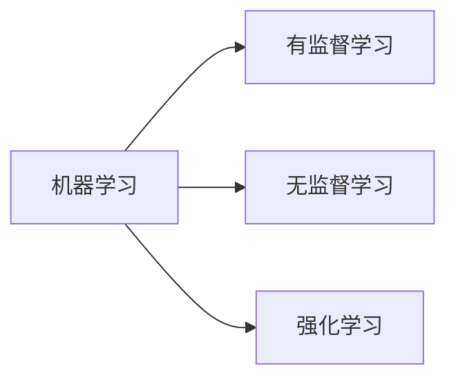

# 机器学习与有监督学习基础概念

## 一、机器学习概述

### 1.1 什么是机器学习

机器学习（Machine Learning, ML）是一种让计算机从数据中自动学习规律和模式，并利用学到的知识对新数据进行预测或决策的技术。与传统的显式编程（人工编写规则）不同，机器学习通过算法从数据中"学会"如何完成任务。

### 1.2 机器学习的核心要素

| 要素 | 说明 |
|------|------|
| 数据 | 机器学习的基础，包括训练数据、验证数据和测试数据 |
| 模型 | 对数据中模式的数学表示，如线性回归模型、决策树、神经网络等 |
| 目标函数 | 衡量模型好坏的指标，如损失函数（Loss Function）|
| 优化算法 | 调整模型参数以最小化损失函数的方法，如梯度下降法 |
| 特征 | 从原始数据中提取的、用于建模的变量或属性 |

### 1.3 机器学习的三大范式



**有监督学习（Supervised Learning）**：训练数据包含输入和对应的标签（答案），模型学习从输入到输出的映射关系。

**无监督学习（Unsupervised Learning）**：训练数据只有输入没有标签，模型自行发现数据中的结构或模式，如聚类、降维。

**强化学习（Reinforcement Learning）**：智能体通过与环境的交互获得奖励或惩罚信号，学习最优策略以最大化累积奖励。

---

## 二、有监督学习

### 2.1 定义

有监督学习是机器学习的一个重要分支。它使用**带有标签（Label）的训练数据**来训练模型。每个训练样本都由一对组成：

- **特征向量 x**：描述样本的输入属性
- **标签 y**：样本的真实输出值或类别

目标是学习一个函数 `f: X → Y`，使其能够对未见过的样本做出准确预测。

### 2.2 形式化定义

给定训练数据集：

```
D = {(x₁, y₁), (x₂, y₂), ..., (xₙ, yₙ)}
```

其中 xᵢ 为特征向量，yᵢ 为标签。有监督学习的目标是找到一个假设函数 `h`，使得对于任意新样本 x，`h(x)` 尽可能接近真实标签 y。

### 2.3 有监督学习的两大类任务

| 任务类型 | 输出类型 | 典型算法 | 应用场景 |
|----------|----------|----------|----------|
| 分类（Classification）| 离散值（类别） | 逻辑回归、SVM、决策树、KNN、神经网络 | 垃圾邮件检测、图像识别、疾病诊断 |
| 回归（Regression）| 连续值 | 线性回归、岭回归、Lasso、随机森林回归 | 房价预测、股票价格预测、温度预测 |

### 2.4 关键术语

- **特征（Feature）**：用于描述样本的独立变量，可以是数值型、类别型或文本型
- **标签（Label）**：样本的真实结果，训练时作为"标准答案"
- **训练集（Training Set）**：用于训练模型参数的数据
- **验证集（Validation Set）**：用于调参和选择模型
- **测试集（Test Set）**：用于评估最终模型的泛化能力，训练过程中不可见
- **过拟合（Overfitting）**：模型在训练集上表现极好，但在新数据上表现差，因为学到了噪声而非真实规律
- **欠拟合（Underfitting）**：模型过于简单，无法捕捉数据中的有效模式
- **泛化能力（Generalization）**：模型对未见过的数据的预测能力

### 2.5 有监督学习的训练流程

```
原始数据 → 数据预处理 → 特征工程 → 数据集划分
                                      ↓
                             训练集 → 选择算法 → 训练模型
                                      ↓
                             验证集 → 调参优化 → 评估
                                      ↓
                             测试集 → 最终评估 → 部署
```

### 2.6 常见损失函数

- **均方误差（MSE）**：`L = (1/n) Σ(ŷᵢ - yᵢ)²`，用于回归任务
- **交叉熵损失（Cross-Entropy Loss）**：常用于分类任务
- **Hinge Loss**：用于支持向量机（SVM）

### 2.7 评估指标

| 任务 | 常用指标 |
|------|----------|
| 分类 | 准确率（Accuracy）、精确率（Precision）、召回率（Recall）、F1分数、ROC-AUC |
| 回归 | 均方误差（MSE）、均方根误差（RMSE）、平均绝对误差（MAE）、R² |

### 2.8 常见算法简介

**线性回归（Linear Regression）**：假设特征与目标之间存在线性关系，通过最小化残差平方和求解参数。

**逻辑回归（Logistic Regression）**：虽名为"回归"，实为分类算法。通过 Sigmoid 函数将线性输出映射到 [0,1] 区间，表示属于某个类别的概率。

**决策树（Decision Tree）**：通过树形结构对特征进行判断和分裂，每个叶节点对应一个预测结果。直观可解释，但容易过拟合。

**支持向量机（SVM）**：寻找最优超平面来分隔不同类别的数据点，使分类间隔最大化。可通过核函数处理非线性问题。

**K近邻（KNN）**：基于距离度量（如欧氏距离），根据样本的 k 个最近邻居的类别投票决定预测结果。无需显式训练过程。

**神经网络（Neural Network）**：由多层神经元组成的非线性模型，可学习极其复杂的模式。深度学习的基础。

---

## 三、机器学习中的关键挑战

### 3.1 偏差-方差权衡（Bias-Variance Tradeoff）

- **高偏差（High Bias）**：模型过于简单，对数据的假设过强，容易欠拟合
- **高方差（High Variance）**：模型过于复杂，对训练数据中的噪声过于敏感，容易过拟合
- 理想模型在偏差和方差之间取得平衡

### 3.2 数据相关挑战

- 数据量不足
- 数据质量差（噪声、缺失值、异常值）
- 类别不平衡（Class Imbalance）
- 特征工程不到位

### 3.3 模型选择与正则化

正则化（Regularization）通过向损失函数中添加惩罚项来抑制模型复杂度：

- **L1 正则化（Lasso）**：产生稀疏解，可用于特征选择
- **L2 正则化（Ridge）**：权重衰减，防止过拟合

---

## 四、核心概念总结

| 概念 | 一句话说明 |
|------|-----------|
| 机器学习 | 让计算机从数据中自动学习规律的技术 |
| 有监督学习 | 使用带标签数据训练模型进行预测或分类 |
| 无监督学习 | 发现未标记数据中的隐藏结构 |
| 强化学习 | 通过与环境交互和奖励信号学习策略 |
| 特征 | 用于建模的输入变量 |
| 标签 | 样本的真实结果 |
| 过拟合 | 模型学得"太好"，记住了噪声 |
| 欠拟合 | 模型学得"不够"，没抓住规律 |
| 泛化 | 模型在新数据上的表现能力 |
| 损失函数 | 衡量预测值与真实值差距的函数 |

---

*参考资料：周志华《机器学习》（西瓜书）、Stanford CS229 课程笔记、scikit-learn 官方文档*
